***
# Software requirements specification
## For Flask simple chats

Version 1.0  
Prepared by Dmytro Afanasiev  
Monday, the 17th of May, 2021  

# Table of contents
1. [Introduction](#1-introduction)  
    1.1. [Purpose](#11-purpose)  
    1.2. [Document conventions](#12-document-conventions)  
    1.3. [Intended Audience and Reading Suggestions](#13-intended-audience-and-reading-suggestions)  
    1.4. [Project scope](#14-project-scope)  
    1.5. [References](#15-references)  
    
2. [Overall Description](#2-overall-description)  
    2.1. [Product perspective](#21-product-perspective)  
    2.2. [Product features](#22-product-features)  
    2.3. [User classes and characteristics](#23-user-classes-and-characteristics)  
    2.4. [Operating environment](#24-operating-environment)  
    2.5. [Design and implementation constraints](#25-design-and-implementation-constraints)  
    2.6. [User documentation](#26-user-documentation)  
    2.7. [Assumptions and dependencies](#27-assumptions-and-dependencies)  
    
3. [System features](#3-system-features)  
    3.1. [Registration, login and logout](#31-registration-login-and-logout)  
    3.2. [Password reset](#32-password-reset)  
    3.3. [Search for companions](#33-search-for-companions)  
    3.4. [Chat with anyone](#34-chat-with-anyone)  
    3.5. [REST API](#35-rest-api)  
    
4. [External Interface Requirements](#4-external-interface-requirements)  
    4.1. [User interfaces](#41-user-interfaces)  
    4.2. [Software interfaces](#42-software-interfaces)  
    4.3. [Hardware interfaces](#43-hardware-interfaces)  
    4.4. [Communication interfaces](#44-communication-interfaces)  
    
5. [Other Nonfunctional Requirements](#5-other-nonfunctional-requirements)  
    5.1. [Performance requirements](#51-performance-requirements)  
    5.2. [Safety requirements](#52-safety-requirements)  
    5.3. [Security requirements](#53-security-requirements)  
    5.4. [Software quality attributes](#54-software-quality-attributes)  
    
    [Appendix A: Analysis Models](#appendix-a-analysis-models)  

## 1. Introduction

### 1.1. Purpose
This SRS is created to describe the software functional requirements for the first release of the Flask Simple Chats application. The document is expected to be used for educational purposes in order to understand and verify the correct system's functioning. Unless a new version is published, everything specified here is based on release 1.0.
### 1.2. Document conventions

The document has to be written in English using markdown format. It has to contain a description of a software system to be developed with all applicable use cases. The specification document must include forms mockups too.

### 1.3. Intended Audience and Reading Suggestions

This specification is a part of EPAM's Final Project so, it is mostly expected to be read and analyzed by its interviewers. The specification was create only for educational purposes so, it is expected to contain mistakes and inaccuracies. It is also expected to be read both by students and teachers and can serve like a common example. The rest of SRS contains necessary requirements to the software and it is suggested to be read gradually.

### 1.4. Project scope
The first release of flask simple chats application will provide users with an opportunity to communicate with each other like in any common chat. The application will not be huge, it will cover only the most necessary features for chatting. The program is going to permit to register, log in and reset a password when it is forgotten. Any registered user will be able to simply search for another one and contact him. All the messages are saved. The application will provide with a simple web interface and clear API to be used by server clients.
### 1.5. References

1. IEEE Software Engineering Standards Committee, “IEEE Std 830-1998, IEEE Recommended Practice for Software Requirements Specifications”, October 20, 1998;
2. IEEE Software Requirements Specification Template: [https://web.cs.dal.ca/~hawkey/3130/srs_template-ieee.doc](https://web.cs.dal.ca/~hawkey/3130/srs_template-ieee.doc);
3. Ajax: [https://en.wikipedia.org/wiki/Ajax_(programming)](https://en.wikipedia.org/wiki/Ajax_(programming));
4. JSON Web Tokens are an open, industry standard [RFC 7519](https://tools.ietf.org/html/rfc7519) method for representing claims securely between two parties: [https://jwt.io/;](https://jwt.io/;)
5. Nginx: [https://nginx.org/en/](https://nginx.org/en/);
6. Gunicorn: https://gunicorn.org/;
7. PostgreSQL: The World's Most Advanced Open Source Relational Database: [https://www.postgresql.org/](https://www.postgresql.org/);
8. Git: [https://git-scm.com/](https://git-scm.com/);
9. Welcome to Flask — Flask Documentation: [https://flask.palletsprojects.com/en/1.1.x/](https://flask.palletsprojects.com/en/1.1.x/);
10. Welcome to Flask-SocketIO's documentation!: [https://flask-socketio.readthedocs.io/en/latest/](https://flask-socketio.readthedocs.io/en/latest/);
11. Flask-SQLAlchemy — Flask-SQLAlchemy Documentation: [https://flask-sqlalchemy.palletsprojects.com/en/2.x/](https://flask-sqlalchemy.palletsprojects.com/en/2.x/);
12. Flask-RESTful — Flask-RESTful 0.3.8 documentation: [https://flask-restful.readthedocs.io/en/latest/](https://flask-restful.readthedocs.io/en/latest/);
13. Get started with Docker Compose: [https://docs.docker.com/compose/gettingstarted/](https://docs.docker.com/compose/gettingstarted/);
14. HTTP documentation: [https://httpwg.org/specs/](https://httpwg.org/specs/)
15. SMTP Email API Documentation: [https://www.smtp.com/resources/api-documentation](https://www.smtp.com/resources/api-documentation)/;
16. WebSocket: [https://en.wikipedia.org/wiki/WebSocket](https://en.wikipedia.org/wiki/WebSocket);
17. Cross Site Request Forgery (CSRF): [https://owasp.org/www-community/attacks/csrf](https://owasp.org/www-community/attacks/csrf).

## 2. Overall Description
### 2.1. Product perspective
This product is only for educational purposes. It does not follow any product families, and does not intend to be a replacement for certain already existing systems. It is not commercial. On the contrary, it is the final educational project for EPAM University Program. Flask simple chats is not supposed to evolve significantly, but some certain parts can be replaced by improved and replaced by better ones.
### 2.2. Product features
The major function performed by the product is to give a very simple and clear interface of a chat, so that other more complex programs could be based on this one. So, all the features provided by the application are below:
- Common authentication system with the opportunity to reset a forgotten password;
- A possibility search for other existing users by using their usernames and names;
- A possibility to establish the chat with just found user and watch the list of all your already created chats;
- An opportunity to send a message to a certain chats user at any time and receive all messages sent to you.
- A possibility to keep in touch with you companion, have a chat directly, send and receive messages immediately without delay;
- Clear and quite simple REST API interface with Basic and Bearer authorization provided. It permits to use all the product functions and ensure the usage experience to be easy and safe.

The data flow diagram in Figure 1 from the Appendix 1 illustrates the main used chat concept with external clients and their communication process.

### 2.3. User classes and characteristics

- Students (favored): It is a well-known fact that the modern generation significantly tends to use different chats and messengers. So, this product is being developed for them. I hope, those, who are highly interested in programming modern complex systems, will find this small application very useful and interesting and will be able to enhance their productivity by studying probable mistakes, which were made here.

### 2.4. Operating environment

- **OE-1:** OS Linux Ubuntu 20.04 or Debian latest versions should be used.
- **OE-2:** Configured Nginx webserver version 1.19.10 on a Linux machine like a proxy-server to python WSGI webserver.
- **OE-3:** Product should use the current stable version of PostgreSQL database engine.
- **OE-4:** Flask simple chats currently shall operate with the following web browsers: Google Chrome version 90.0.4430.212 stable, Firefox Standard release version 88.0.1, Opera on desktop version 76.0.4017.123.
- **OE-5:** Flask simple chats web interface shall permit users to access from the corporate Intranet and, if a user is authorized for outside access through the corporate firewall, from an Internet connection at the user’s home.

### 2.5. Design and implementation constraints

- **CO-1:** All the system must be written in Python;
- **CO-2:** All the source code must be written adhering PEP-8 Code standard in Python with high code quality metrics calculated;
- **CO-3:** Python Flask and Flask RESTful microframework shall be used;
- **CO-4:** Database connection shall be established using SQLAlchemy and Object-Relation-Mapping concept;
- **CO-5:** Application logging should be configured and enabled;
- **CO-6:** Application shall be fully covered by unit tests;
- **CO-7:** Project should be successfully built with Travis-ci;
- **CO-8:** Code coverage should be available on coveralls.io;

### 2.6. User documentation

- **UD-1:** The system should provide clauses and tips in order to enhance user experience productivity.
- **UD- 2:** A user guide to the implemented REST API interface with detailed explanations and examples mush be written and published on GitHub project page.

### 2.7. Assumptions and dependencies

- **DE-1:** Currently flask simple chats application security partly depends on python 'Evetnlet' library. Version 0.30.2 is used, because the latest one is not compatible with WSGI server Gunicorn 20.1.0, which is also compulsory used. They cause an error working together. Despite that, the latest version 0.31.0 of 'Eventlet' has a serious security improvement against DoS attack. So, when the issue is solved and the newest version works properly, it must be installed and used immediately.

## 3. System features

### 3.1 Registration, login and logout

#### 3.1.1 Description and Priority

All the messages from a certain chat anyway must be available to read only for two companions from this chat. So, to restrict the access to the foreign chats, standard authentication system must be implemented. Users must be able to register, log in and log out whenever they need. The major functionality should be available only for registered users. **Priority is high.**

#### 3.1.2 Stimulus/Response Sequences

- **Stimulus:** User goes to a registration page inputs his credentials and submits the form. Expected form mockup is shown in the picture 1.1.
  **Response:** System receives the credentials, verifies their propriety. If the data is valid, system returns a success message and redirects the user into index page. The server adds the user to database.

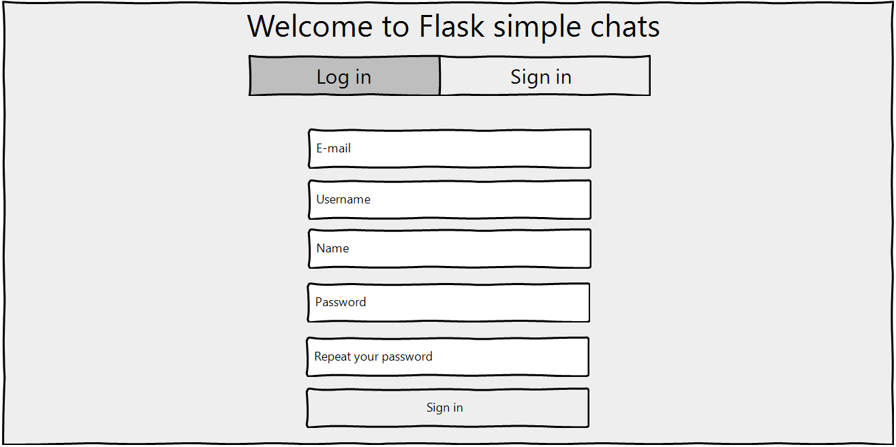
**Picture 1.1** - Registration page

- **Stimulus:** Already registered user goes to the login page fills in the form with his email and password and send submits. Form's mockup is depicted in the picture 1.2.
  **Response:** If given email exists and the password is correct, system adds user into the current session and redirects him to the index page. The users has just logged in. He can use all the product features.

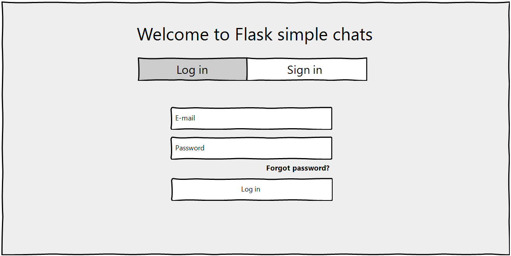
**Picture 1.2** - Login page

- **Stimulus:** Logged in user pushes the logout button.
  **Response:** System removed the user from the current session lets him log out and sends status message. After logging out user is redirected to the index page and status message is shown like in the picture 1.3. 

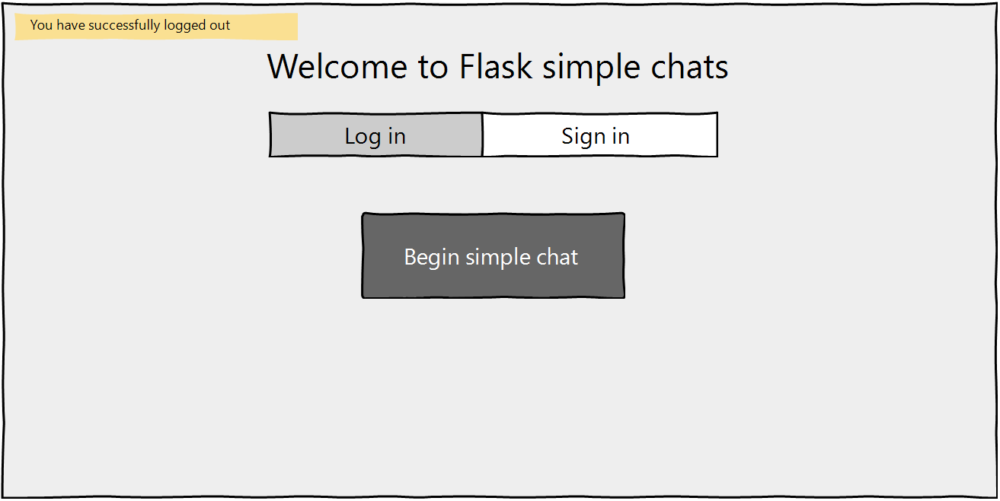
**Picture 1.3** - Logout message

#### 3.1.3 Functional Requirements

- **FU-1.1:** System has to restrict user's abilities if he is not logged in;
- **FU-1.2**: After registration user's password must be hashed and saved to database together with the rest of the data;
- **FU-1.3**: All the form's fields must be required to fill in during the registration and login;

- **FU-1.4:** During the registration user's email and username has to be unique and has not to exist in database before. If there is a coincidence, user has to put another data;
- **FU-1.5:** Password length has to be checked on the server and be bigger than eight chars;
- **FU-1.6:** User must not be able to register if he has already logged in;
- **FU-1.7:** System logout must be performed by clicking only on one certain button. 

### 3.2 Password reset

#### 3.2.1 Description and Priority

In a case when a certain user has forgotten his password, the system should give an opportunity to reset the password by sending an e-mail with further instructions and a reset link. After some certain time reset password link must stop being valid. If user visits such an invalid link, he must be notified, that the link has expired. **Priority is middle**

#### 3.2.2 Stimulus/Response Sequences

- **Stimulus:** The user who does not remember his password goes into forgot password page like in the picture 2.1. To make the start password reset process, user has to input his email and submit the form.
  **Response:** Having received the email, system checks whether such an email exists in database or not. If it does, system sends password reset link to user's email.

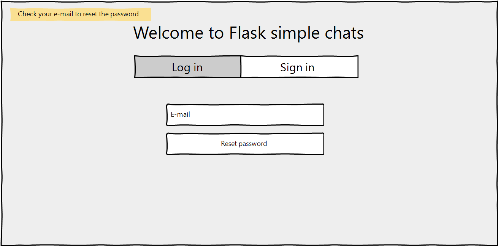
**Picture 2.1** - Forgot password page

- **Stimulus:** The user goes to his mail account and see a message from the application with password reset link (picture 2.2). User must follow the link. There he may input his new password two times and send the form to the server (picture 2.3).

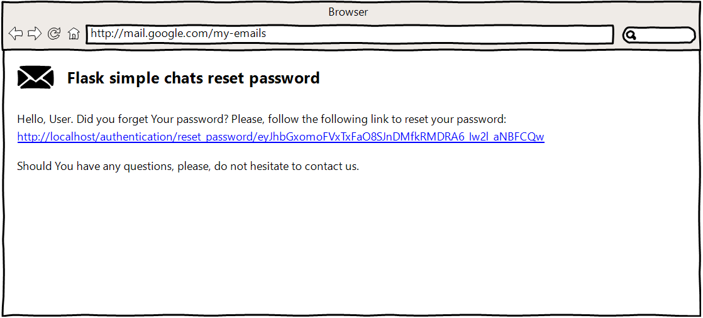
**Picture 2.2** - Mail message

​      **Response:** The system receives new password. It guesses who the current user is by the URL path token from the request. The system changes the password for the appropriate user and redirects him to the index page.

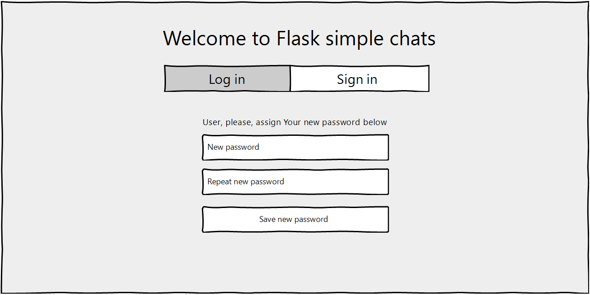
**Picture 2.3** - Input new password

- **Stimulus:** User follows the reset link after it has expired.
  **Response:** Server identifies that the request has come from the expired link, so it returns a page with an error message like in the picture 2.4.

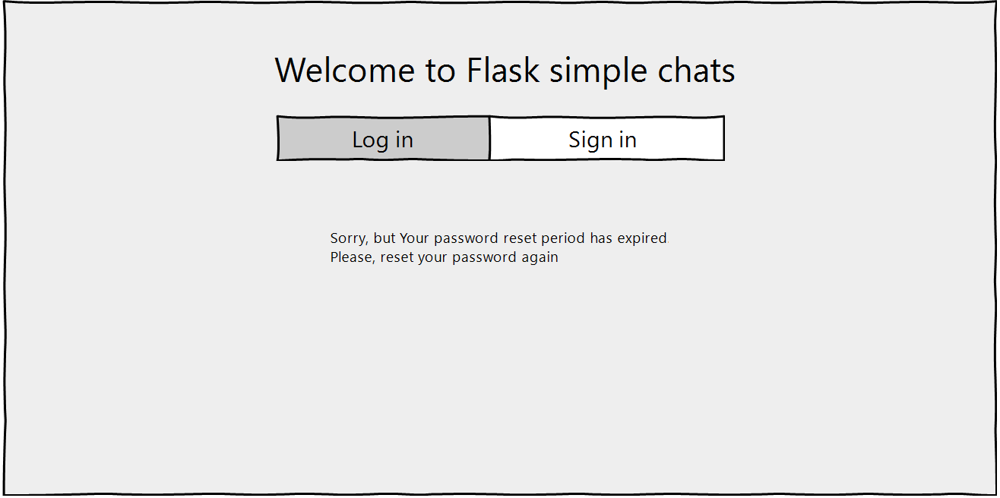
**Picture 2.3** - Input new password

#### 3.2.3 Functional Requirements

- **FU-2.1**: Password reset must work properly and fast;

- **FU-2.2:** Password reset token must be timed, so, it is expired after some certain period;
- **FU-2.3**: After resetting new user's password must be hashed and saved to database together with the rest of the data;
- **FU-2.4**: Password reset function must be always available;

### 3.3 Search for companions

#### 3.3.1 Description and Priority
First time each user does not have any chats, so, he has to create a some one. Registered users should be able to search for a message recipient or a chat companion by a name or username. After searching, if at least one recipient is found, user should have an opportunity to send a message to the recipient immediately. By this way, a new chat must be created between the users. **Priority is high.**

#### 3.3.2 Stimulus/Response Sequences

- **Stimulus:** Having come to the search page (picture 3.1), user inputs a string with a probable name or username and submits the ajax form. 

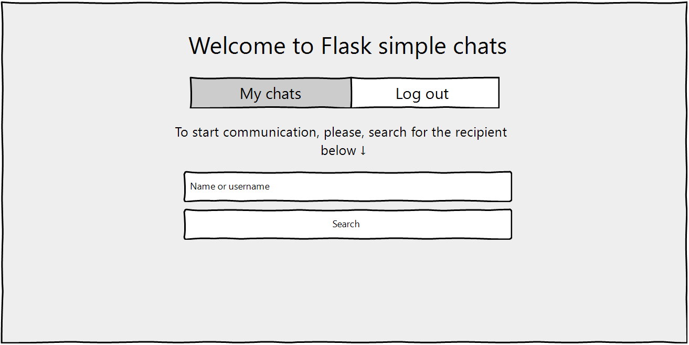
**Picture 3.1** - Search page

​      **Response:** Server processes the received string and performs a search for all the users in a database excluding the current one. Those users, who are found will be shown to the searcher together with the link for creating a chat between. The result of such a search is in the picture 3.2.

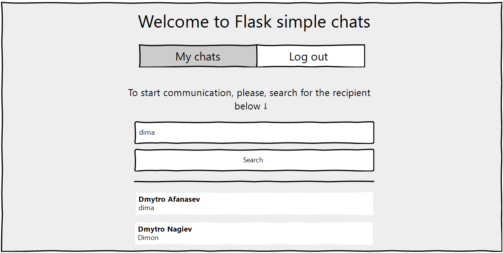
**Picture 3.2** - Search result

#### 3.3.3 Functional Requirements

- **FU-3.1**: The search must be perform on both users' names and usernames;
- **FU-3.2:** Even partial coincidences should be shown as results;
- **FU-3.3**: Search form should be AJAX [3];
- **FU-3.4**: If multiple words are passed, the search must be performed for each word;
- **FU-3.5** If nothing is found, status message should be shown.

### 3.4 Chat with anyone

#### 3.4.1 Description and Priority
When user is registered he should be able both search for a companion to send him a message and have his own list of created chats, ordered by the last messages time writing. Hence, user will be able to join any his chat and continue the communication. Messages will be shown immediately after sending and will be saved to database. **Priority is high.**

#### 3.4.2 Stimulus/Response Sequences

- **Stimulus:** The registered user goes to chats list page.
  **Response:** The system returns all the users, chat with has already been started. The last message from each chat is also printed. User can join a certain chat by clicking on the appropriate link. The mockup of the described event is shown in the picture 4.1.

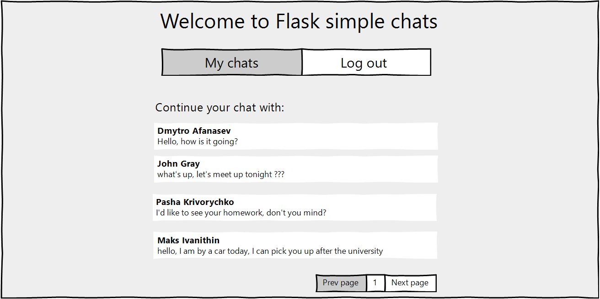
**Picture 4.1** - The list of user's chats

- **Stimulus:** The user clicks to the arbitrary link and join the chat. He sends a couple of messages and receives answers.
  **Response:** The system make a room between two users. It receives a message from one user, saves it to database and resends to both users. Look at the picture 4.2 below.

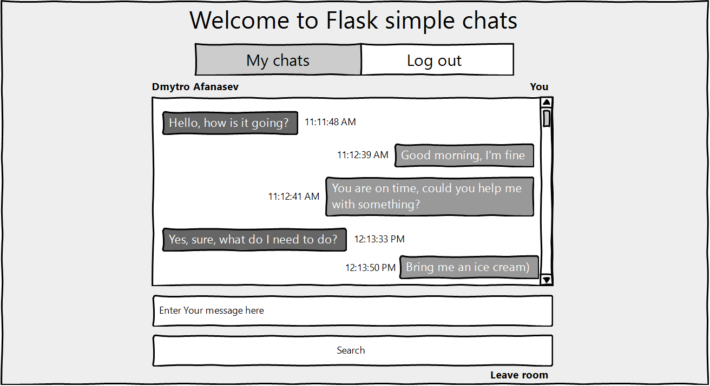
**Picture 4.2** - Chat is going

#### 3.4.3 Functional Requirements

- **FU-4.1**: The list of user's chats must be sorted by last message time writing from each chat;
- **FU-4.2:** Together with users' names, last chat message must be printed in chats list;
- **FU-4.3**: The list should be split into pages in order not to request too much data at once;
- **FU-4.4**: The sequent of messages must be clear. Messages must appear one by one, in order of sending;
- **FU-4.5:** When user joins the room, not all the old messages must be loaded, only some small part. The rest of the messages should be loaded when user scrolls the chat;
- **FU-4.6:** Empty messages must not be sent.

### 3.5. REST API

#### 3.5.1. Description and Priority

The product should provide a simple and logical REST API interface with an opportunity to do everything, like a common web-user. API must contain registration and authentication, API user must be able to see the list users, the list of his chats and messages. He should be as strong in his abilities, as the common web-user. **Priority is middle**

#### 3.5.2. Stimulus/Response Sequences

- **Stimulus:** User sends a request to register in a system, giving his credentials;
  **Response:** The system validates the credentials, save user's data to database and return success code;
- **Stimulus:** Already registered user sends a request with attached username and password to get authentication token;
  **Response:** The system proceeds the credentials, recognizes the user, creates a timed authentication token and sends it back to the user.
- **Stimulus:** The user sends all following requests with attached received token, by the time it expires;
  **Response:** The system proceeds the token and can exactly recognizes the user, and be sure, that the request is safe. Then, system performs user's requests and returns prepared data. The data flow diagram for the described event is depicted in the Figure 2 from the Appendix A.

#### 3.5.3. Functional Requirements

- **FU-5.1**: Basic base64 encoded http authorization must be provided. Bearer JWT [4] authorization must be provided too. After registration, user should be able to receive authentication token by sending a certain request with his credentials. Only those users, who use any of provided authorization systems, can use major functional;
- **FU-5.2:** User should be able to update his username and/or name by sending a special request;
- **FU-5.3**: Rest API should give a possibility to see the list of all system users or see a certain user by his id;
- **FU-5.4**: User should be able to see all his started chats, create and delete a certain chat by sending the appropriate request. When the chat is deleted, all the messages in are also deleted;
- **FU-5.5:** User shall have a possibility to see all the messages from a certain chat and see one message by given id. He also must be able to send messages to any recipient by putting a special request. The system also should give a possibility to send a multiple number of messages by one request, delete certain message from a certain chat and update the text of message;
- **FU-5.6:** The system must allow to use URL query parameters to filter, sort and limit the output of GET requests.

## 4. External Interface Requirements

### 4.1. User interfaces

- **UI-1:** The Web pages shall permit complete navigation between all the existing pages and simple not too bright interface. Occurred error messages should be carefully dropped to user, so that he can understand what happened to him.
- **UI-2:** The product should implement REST API interface with clear structed responses and understandable error messages

### 4.2. Hardware interfaces

Currently no hardware interfaces have been identified.

### 4.3. Software interfaces

- **SI-1:** Nginx webserver version 1.19.10 [5] on a Linux machine like a proxy-server to python WSGI webserver;
- **SI-2:** Gunicorn version 20.1.0 [6] and higher must be used instead of standard python webserver;
- **SI-3:** PostgreSQL 13.3 [7] and newer database engine shall be used to save and back up data;
- **SI-4:** Git [8] version control shall be used for tracking changes in project source files;
- **SI-5:** Python Flask 1.1.2 [9] must be used as a base to build a web application;
- **SI-6:** Flask SocketIO 5.0.1 [10] and higher should be used to perform direct communication;
- **SI-7:** Flask SQLAlchemy 2.5.1 [11] should be used to perform operations with database;
- **SI-8:** Flask Restful 0.3.8 [12] should be used to implement REST API interface;
- **SI-7:** Docker and docker-compose [13] can be used to make deployment process easier.

### 4.4. Communications Interfaces

- **CI-1:** Simple chats application must use HTTP/1.1 [14] communication standard;
- **CI-2:** SMTP Transfer Protocol [15] must be used to send e-mails to users;
- **CI-3:** WebSocket transfer protocol [16] should be used to adjust the communication.

## 5. Other Nonfunctional Requirements

### 5.1. Performance Requirements

- **PE-1:** Chat's messages shall be displayed after sending with delay no longer than 1 second;
- **PE-2:** All Web pages generated by the system shall be fully downloadable in no more than 1 seconds with modern fast network connection;

### 5.2. Safety requirements

Currently no hardware interfaces have been identified.

### 5.3. Security requirements

- **SE-1:** Secure HTTP Protocol (HTTPS) must be compulsory used in order not to expose users' personal messages;
- **SE-2:** Web forms must be secured from Cross-Site Request Forgery [17] by using CSRF-tokens;
- **SE-2:** Users shall be required to log in to the Simple chats for all operations except viewing an index page;
- **SE-3:** The system shall permit users to view only their own and their companion's previously placed messages, not messages, placed by other users.
- **SE-4:** All the interaction with REST API interface must be secured by Basic or Bearer https authorization.

### 5.4. Software quality attributes

- **Robustness-1:** Product source code should be fully covered by unit tests, all the usage cases shall be experienced in development conditions in order to prevent from unexpected errors;
- **Robustness-1:** Required versions of python libraries shall be used not to cause sharp errors.

## Appendix A: Analysis Models

**Figure 1** - Data flow diagram for the chat system

**Figure 2** - Data flow diagram for REST API Bearer authorization
